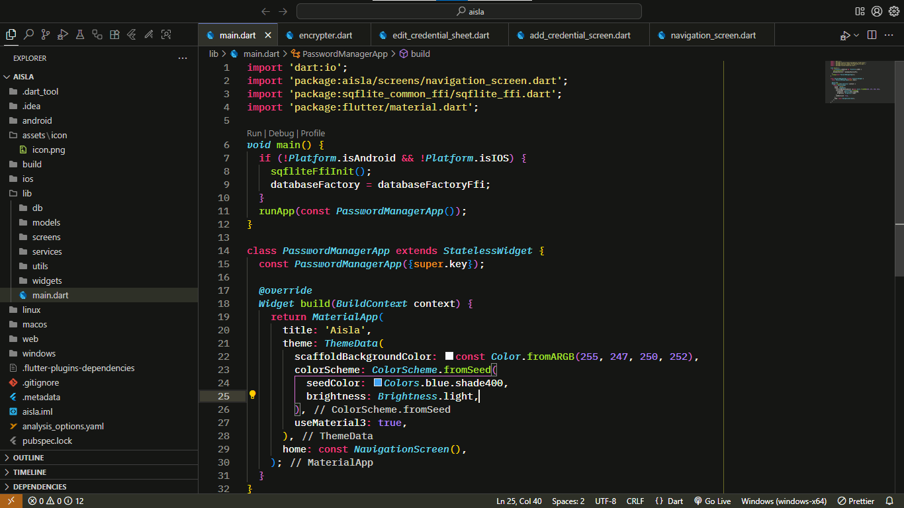

# 👽 Monokai With Contrast

A Visual Studio Code theme inspired by **Monokai**, with a more modern style and a personalized touch.
Perfect for those who enjoy vibrant colors on a dark background.

## ✨ Features

- 🎨 Based on the classic Monokai color palette.
- 🖥️ Compatible with VS Code on Windows, macOS, and Linux.
- 🔍 Syntax support for multiple languages (PHP, JavaScript, Python, Dart, etc.).
