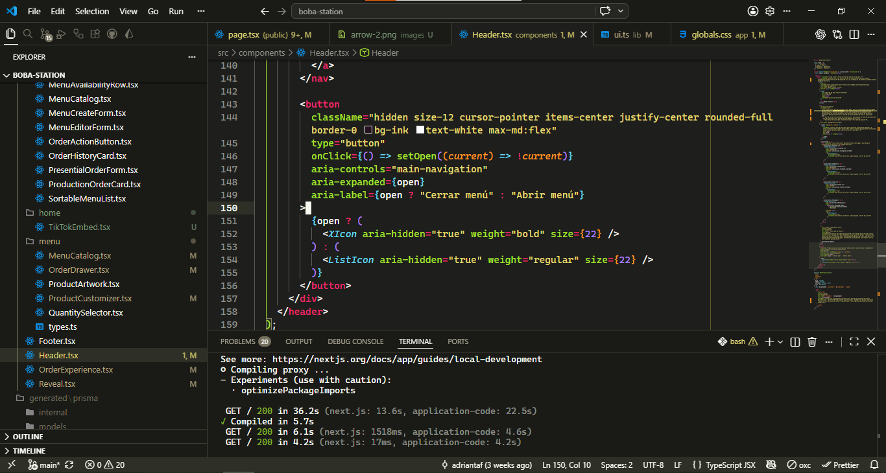

# Monokai Modern Contrast

Classic Monokai on the code. A quiet olive workbench around it.

The six Monokai colors stay where they belong — keywords, strings, types, functions, numbers, parameters. Everything else stays paper. Chrome is olive, not neon.



## Install

In VS Code or Cursor: **Extensions** → search `Monokai Modern Contrast` → Install, then select it from **Color Theme**.

```
ext install AdrianTafoya.monokai-modern-contrast
```

## vs classic Monokai

- Editor `#1E1F1C`, sidebar `#1A1B17` — a step deeper than `#272822`, still olive
- Tabs, badges, and focus stay in the brown-olive family (`#75715E` / `#99947C`)
- Keyword pink is the original `#F92672`; operators and most identifiers stay `#F8F8F2`
- Git marks and tree selection are muted so they do not compete with the code

## Palette

| Token | Hex | Used for |
| --- | --- | --- |
| Background | `#1A1B17` / `#1E1F1C` | Chrome / editor |
| Foreground | `#F8F8F2` | Text, operators |
| Keyword | `#F92672` | `if`, `class`, tags |
| String | `#E6DB74` | Strings |
| Function | `#A6E22E` | Functions, classes |
| Type | `#66D9EF` | Types (italic) |
| Number | `#AE81FF` | Numbers, booleans |
| Parameter | `#FD971F` | Parameters (italic) |
| Comment | `#75715E` | Comments |
| Accent | `#75715E` | Badges, buttons |

## Recommended

```json
{
  "workbench.colorTheme": "Monokai Modern Contrast",
  "editor.semanticHighlighting.enabled": true
}
```

## License

MIT

A theme by [Bektor](https://bektor.tech)
